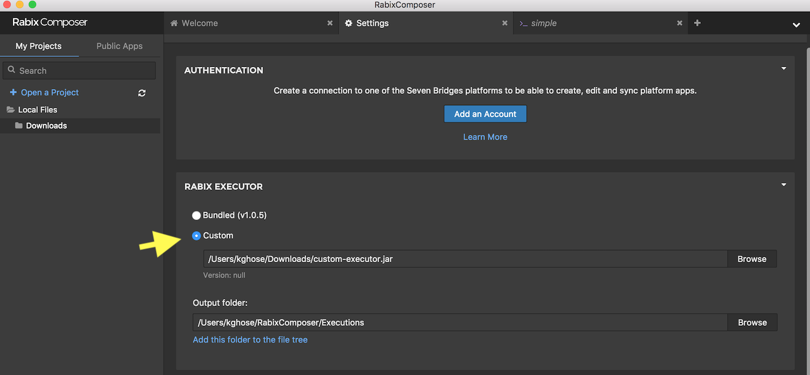

# Custom Executors for Rabix Composer

These are Java bindings (simple wrappings) of CWL executors so that they 
can be selected from the Desktop Rabix Composer settings menu and be invoked when
clicking run from the "Test" panel. They many not have the correct logging
format to let the "throbber" feature of the Test pane work, but execution
will proceed.

## Instructions
1. Download the wrapping you want from the Releases page and 
   place it in a location of your choosing
2. Point Desktop Rabix Composer to this location using the
   settings menu.

 
